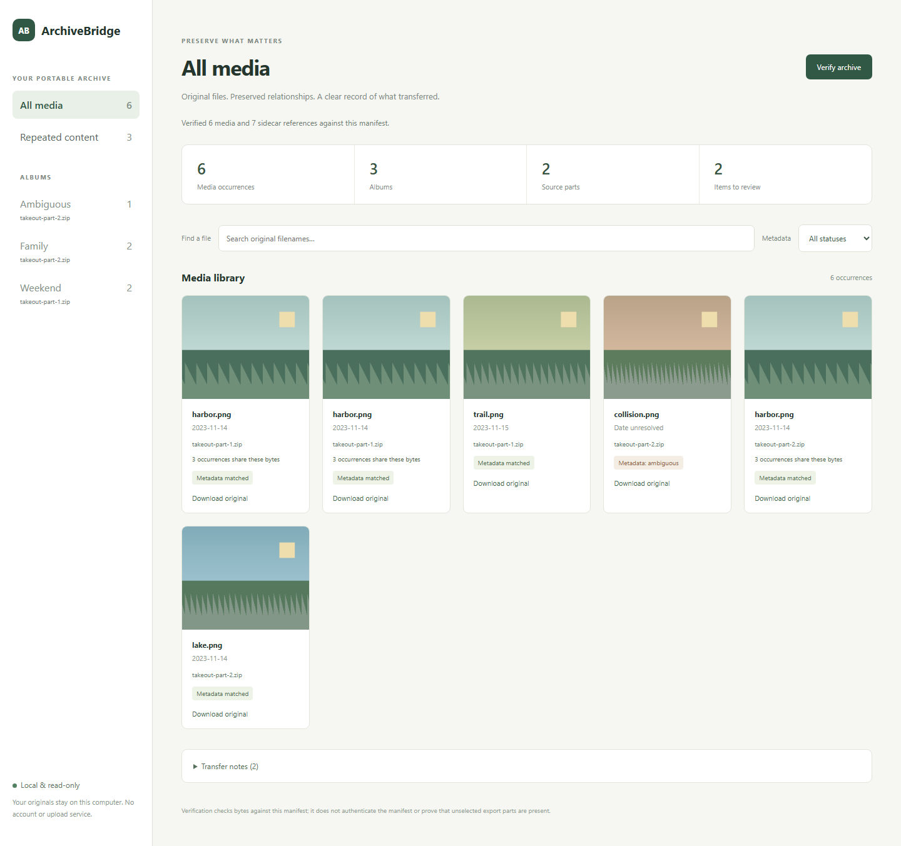

# ArchiveBridge
[](https://github.com/Pastalikek65/archivebridge/actions/workflows/ci.yml)

ArchiveBridge reads selected Google Photos Takeout parts and stores original media, sidecars, supported dates, source occurrences, and album relationships in a local archive.

[Releases](https://github.com/Pastalikek65/archivebridge/releases) · [Get started](#get-started) · [Türkçe hızlı başlangıç](docs/quickstart-tr.md) · [Verification](docs/verification.md)

This guide describes the ArchiveBridge 1.0.0 command set. The [Releases page](https://github.com/Pastalikek65/archivebridge/releases) shows which versions and platform packages are available. Match the package version to its release entry, checksum file, and version-specific evidence. Earlier-version evidence applies only to that version.



## Get started

The commands below require ArchiveBridge 1.0.0 or later. Check the installed version first. Use a 1.0.0 Windows x64 or Linux x64 package from Releases when that version is listed; otherwise build the 1.0.0 source as shown below. Verify each package against the `SHA256SUMS.txt` file from the same release entry before extracting it.

On Linux, run the portable command from the extracted package directory:

```sh
./archivebridge --version --json
./archivebridge plan --source takeout-part-1.zip --source takeout-part-2.zip --output plan.json
./archivebridge export --plan plan.json --out my-photo-archive
./archivebridge verify --archive my-photo-archive
./archivebridge serve --archive my-photo-archive
```

On Windows PowerShell, use `archivebridge.exe`:

```powershell
.\archivebridge.exe --version --json
.\archivebridge.exe plan --source takeout-part-1.zip --source takeout-part-2.zip --output plan.json
.\archivebridge.exe export --plan plan.json --out my-photo-archive
.\archivebridge.exe verify --archive my-photo-archive
.\archivebridge.exe serve --archive my-photo-archive
```

Open `http://127.0.0.1:4175` to browse the archive, filter albums and metadata status, download originals, or run integrity verification. Stop the read-only viewer with Ctrl+C.

Use `inspect --source ...` for a preview before writing a plan. Use `compare --plan plan.json --archive my-photo-archive` to recheck the original source parts against the plan and archive. Use `resume --plan plan.json --out my-photo-archive` to continue an export; existing files are verified before reuse. Keep the source parts available for compare and resume.

## Import a selected archive into Immich

The Immich adapter requires ArchiveBridge 1.0.0 or later and Immich server version 3.3.1 exactly. Review the local plan before importing. The API key is read from an environment variable and is never accepted as a command-line value.

```sh
./archivebridge immich plan --archive my-photo-archive --json
./archivebridge immich import --archive my-photo-archive --server https://immich.example --report immich-import.json
./archivebridge immich verify --archive my-photo-archive --server https://immich.example --report immich-import.json --output immich-verify.json
```

The default API-key variable is `ARCHIVEBRIDGE_IMMICH_API_KEY`. Set it before the import command. The adapter checks the server version, account, and seven required API-key permissions before it changes the server; it does not request `asset.update` or asset-delete permissions. The full permission list and recovery rules are in the [command guide](docs/cli.md).

The default plan blocks media with missing, malformed, ambiguous, or conflicting dates. Add `--skip-unresolved` to leave those occurrences untransferred and record them as skips. Takeout provides no original filesystem modification time. For a ready upload, the adapter sends a generated minimal date-only XMP sidecar with the known Takeout UTC date and sets Immich's required `fileCreatedAt` and `fileModifiedAt` to that date. Immich's metadata worker must report matching dates, including `ExifDateTimeOriginal`, before the upload is marked ready or album changes begin. Plan and operation JSON identify this rule with `dateTransferPolicy=takeout-date-authoritative-generated-xmp-v1`. Original media bytes and embedded EXIF stay unchanged. Raw Takeout JSON sidecars remain local, and their caption or GPS fields are not mapped to Immich.

An import report is private operation state. If cancellation or the bounded metadata-worker wait expires after Immich accepts an upload, the partial report retains its asset ID for explicit reconciliation. Resume with `--resume immich-import.json --report immich-resume.json`; the new report path must not exist. The prior report is preserved. Resume checks the archive, server, version, and authenticated account before reconciling incomplete operations. Protect reports because they contain source filenames, album details, server origin, and account identity. They do not contain the API key or its environment-variable name.

The adapter uploads and verifies only the selected archive; it does not claim to transfer an entire account and has no remote-delete command. HTTPS is required. HTTP is permitted only with `--allow-http-loopback` and the literal loopback IP `127.0.0.1` or `::1`.

## Try the included example

The package includes two Takeout-shaped archives made from synthetic images and metadata. These commands create a local archive you can inspect without connecting to a service:

```sh
./archivebridge plan --source examples/sample/takeout-part-1.zip --source examples/sample/takeout-part-2.zip --output sample-plan.json
./archivebridge export --plan sample-plan.json --out sample-archive
./archivebridge verify --archive sample-archive
./archivebridge serve --archive sample-archive
```

The example contains six media occurrences, four distinct media contents, seven sidecars, and three albums. One media occurrence has conflicting sidecars, so it remains unresolved. Identical content can share stored bytes while every source occurrence and album relationship remains in the manifest.

## What the archive preserves

- Original supported photo and video bytes, plus every raw JSON sidecar
- Source occurrences and album membership, including repeated media
- Supported sidecar timestamps as separate UTC manifest dates
- Unresolved and unsupported information as visible issues

ZIP and TAR.GZ parts are read together. Matching uses supported exact same-folder names or unique metadata titles. Unknown members are listed and are not presented as transferred media. The archive covers only the selected parts. It does not prove account completeness or repair, decode, or decrypt source files.

Local archive verification checks stored bytes against an unsigned manifest; it does not authenticate the manifest. Plans contain private local source paths. Keep plans, archives, and Immich reports private.

See [supported formats and limits](docs/support.md), the [command guide](docs/cli.md), [architecture](docs/architecture.md), [roadmap](docs/roadmap.md), [verification](docs/verification.md), and [Türkçe hızlı başlangıç](docs/quickstart-tr.md).

## Build from source

Go 1.27.2 is required to build this source tree. Downloaded packages require no Go, Python, or Node installation.

On Linux, build and test with:

```sh
go test ./...
go build -trimpath -o archivebridge ./cmd/archivebridge
```

On Windows, include the executable extension:

```powershell
go test ./...
go build -trimpath -o archivebridge.exe ./cmd/archivebridge
```

The browser and packaging tools are development tools, not application dependencies. See [contributing](CONTRIBUTING.md). Application code is Apache-2.0; bundled Go runtime and standard-library notices are in [third_party](third_party/README.md).
